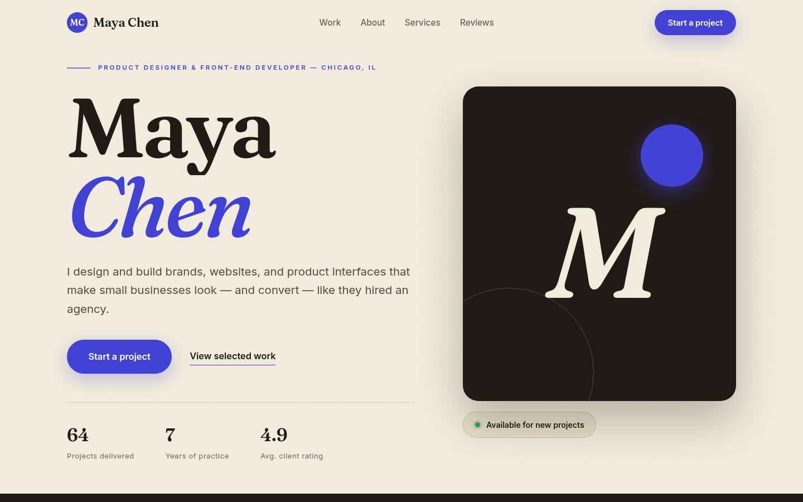

> **Live demo:** [https://maya-chen-portfolio-template.vercel.app](https://maya-chen-portfolio-template.vercel.app)



---

# Maya Chen — Freelancer Portfolio Template

An award-style, single-page portfolio template for a freelance designer /
developer, demoed with the fictional persona **"Maya Chen — Product
Designer & Front-End Developer"** (Chicago, IL). Warm paper palette, cobalt
accent, oversized Fraunces serif headline with an italic accent word, duotone
monogram hero visual (no fake stock portrait), and a marquee strip for rhythm.

## What's included

- **Hero** — giant name headline with staggered line reveals, role/location
  kicker, availability badge, one primary CTA ("Start a project") + one
  quiet secondary link ("View selected work"), animated stat counters
- **Marquee strip** — infinite capability ticker (the single ambient motion)
- **Selected work** — 6 project cards with real local photography, offset
  editorial grid, hover zoom (1.045) + overlay sweep revealing "View case study"
- **About** — asymmetric editorial layout, dropcap intro, credibility
  checklist, portrait photo
- **Services** — 4 fixed-price services in hairline-divider rows with
  hover interactions
- **Reviews** — 2 client testimonials with star ratings
- **Contact** — big-type CTA banner, primary mailto button, email / phone /
  location details
- **Footer** — statement headline, nav, social links, copyright

## The key selling feature: one CONFIG block

Open `script.js` and edit the `CONFIG` object at the very top. Everything
updates automatically — **no HTML or CSS editing required**:

| Field | What it controls |
|---|---|
| `name` / `monogram` | Display name and brand-mark letters (hero, nav, footer) |
| `role`, `kicker`, `lede`, `availability` | Hero and footer copy |
| `ctaLabel` | The ONE primary button label, everywhere it appears |
| `email`, `phone`, `location`, `locationFull` | Contact details + mailto/tel links |
| `colors.enabled` + `colors.accent` | Rebrand the whole palette from JS (e.g. `"#b3451f"`). Set `enabled: false` to edit `styles.css` by hand instead |
| `projects` | The entire work grid — add, remove, reorder cards (title, category, result, image, alt) |
| `socials` | Footer social links — add or remove freely |

Photos for new projects go in `assets/` (local files only — never hotlink;
the sandbox browser blocks some image hosts). Keep them ≤1600px wide and
baseline-encoded JPEGs.

## Tech

Plain HTML, CSS, and JavaScript — no frameworks, no build step. Fraunces +
Inter are self-hosted as static TTFs in `assets/fonts/` (no external font
requests, and variable-font crashes avoided). Motion: one easing curve
`cubic-bezier(0.22,1,0.36,1)`, IntersectionObserver scroll reveals, and
`prefers-reduced-motion` support. Semantic HTML, one `<h1>`, meta/OG tags,
and JSON-LD `Person` schema included.

## View it

Open `index.html` directly, or serve the folder:

```bash
cd ~/workspace/upwork-portfolio/05-freelancer-portfolio
python3 -m http.server 8080
# then visit http://localhost:8080
```

Screenshots: `screenshots/desktop-hero.png`, `screenshots/desktop-mid.png`,
`screenshots/mobile.png` (1440×900 / 390×844, captured in Chromium).
